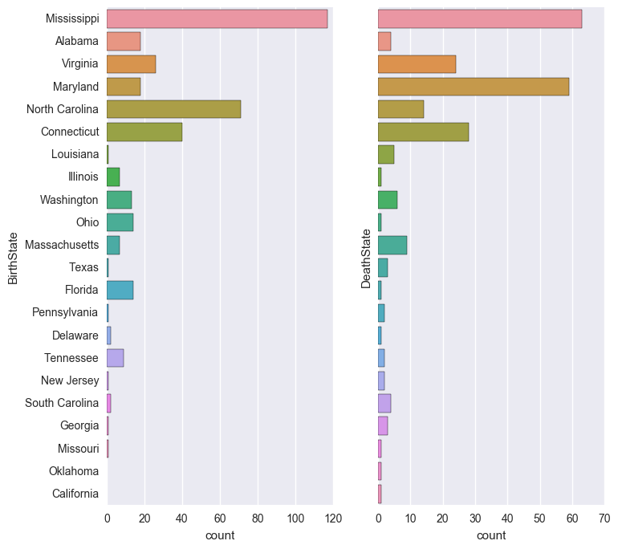

**Note**: Parts of this notebook did not render properly, so see the my [github post](https://github.com/JeffMacaluso/Blog/blob/master/AncestryAnalysis.ipynb) for the complete version.

# Introduction
My wife and I are both interested in our genealogy and genealogical record, and subsequently have an [Ancestry account](www.ancestry.com). We both have family that reaches *really* far back (...in American terms), and have put in a lot of time into tracking and researching our ancestral records.  

In reviewing the record, I became interested in the possibilities of analyzing the raw data that might be available within our respective genealogies. I discovered you can extract a [GEDCOM](https://en.wikipedia.org/wiki/GEDCOM) (**Ge**nealogical **D**ata **Com**munication) file, and since I was trying to improve my Python data munging skills, I thought - why not analyze my ancestry?


There are a few Python packages out there that will load a GEDCOM file directly into Python, but I ended up using the GNU program [GRAMPS](https://gramps-project.org/) to convert it into a series of CSVs.  GRAMPS technically does about 80% of what I wanted to do - and is ironically built with Python - but just using it wouldn't be nearly as fun.

# Questions to Explore
- What were the family names of my ancestors?
- Which states contained the most births or deaths?
- How mobile were my ancestors over time?
- How has the average life span changed over time?
- What was the migratory pattern of my ancestors across states?

I have also posted a summary at the bottom of the notebook with answers to these questions without the related code.

# Caveats
In addition to the data being **really** messy, there are a few restrictions that may impact some of the analysis:
* The basic Ancestry account will only pull records for those residing in the United States.
* While my maternal side of the family in the US goes back to the colonial times, my paternal side of the family are relatively recent immigrants from Italy.  This causes an imbalance in the data, so that the majority of the data is from my maternal side of the family.
- In the context of the time vs. quality tradeoff, time took precedent in my analyses due to the level and depth of data cleaning necessary. For example, "somewhere in the delta" being listed as a birth place may be important to examine and adjust within a professional setting, looking at the state and country of birth. However, for my interest-based purposes, I decided against completing an in-depth and time-consuming data munging of all available data points. 

With that all said, let's get started!


```python
import numpy as np
import pandas as pd

import matplotlib.pyplot as plt
import seaborn as sns
from chorogrid import Colorbin, Chorogrid  # For plotting choropleth maps
from colour import Color  # Easily creating colors for the maps

plt.style.use('seaborn-deep')  # Keeps plot aesthetics consistent
pd.set_option('display.max_columns', None)  # Displays all columns for wide data frames

%matplotlib inline
```

# Part I
## The Data
We have four CSVs at our disposal:
- **Individual Detail**: The bulk of our data - one row for every individual with various information shown below
- **Marriage Detail**: The husband/wife, date, place of marriage, and a "family" key
- **Family Detail**: The "family" key and children
- **Place Detail**: The "place" key and address.  In the end, I did not end up using this, but it would be useful if I wanted to look at locations of marriage or burial.

Since some of the columns in the tables had either little or no data, I included lines to drop any columns without data, and manually viewed each table with the Pandas .info() command to see which columns contained too few records to be of use.

You'll also see as we go on that this data is *messy*.  It has a lot of missing records, and some of the data is clearly in the wrong place.  The formatting is also very inconsistent.  For example, I have seen all of the following formats for dates: '29 Dec, 1865', '12/29/1865', '1865-12-29', '1860s', and 'about Dec 1865'.


```python
# Individual Detail
df = pd.read_csv('Macaluso_Tree.csv', nrows=489)
df.dropna(axis = 'columns', how='all', inplace=True)  # Drops any column that doesn't contain any data
df.info()

# Marriage Detail
Marriage = pd.read_csv('Macaluso_Tree.csv', skiprows=490, nrows=87)
Marriage.dropna(axis='columns', how='all', inplace=True)

# Family Detail
Family = pd.read_csv('Macaluso_Tree.csv', skiprows=579, nrows=407)
Family.dropna(axis='columns', how='all', inplace=True)
```

    <class 'pandas.core.frame.DataFrame'>
    RangeIndex: 489 entries, 0 to 488
    Data columns (total 13 columns):
    Person           489 non-null object
    Surname          483 non-null object
    Given            486 non-null object
    Suffix           20 non-null object
    Gender           489 non-null object
    Birth date       460 non-null object
    Birth place      400 non-null object
    Birth source     132 non-null object
    Death date       308 non-null object
    Death place      250 non-null object
    Death source     36 non-null object
    Burial place     21 non-null object
    Burial source    20 non-null object
    dtypes: object(13)
    memory usage: 49.7+ KB
    


```python
# Too few sources to bother with
df.drop(['Birth source', 'Death source', 'Burial source'], axis=1, inplace=True)

# Create a new column for full name.  Correcting often misspelled last name.
df.replace(to_replace='MacAluso', value='Macaluso', inplace=True)  # No, it's not Scottish or Irish
df["Name"] = df["Given"].map(str) + " " + df["Surname"]

# Renaming the columns to make them more intuitive
Family.columns = ['Family', 'Person']
```

In order to combine the three tables and tie the parents to the children, I had to join the Marriage data frame to the Individual data frame before combining it all together.

Here's a quick look at the information I'll be adding to the main data frame for the parents.  You can also note the 'about 1842' under the Father Birth date column, with no country listed for the first record under Father Birth place, and many missing values.


```python
Father_Info = df.drop(['Surname', 'Given', 'Suffix', 'Gender'], axis=1)

# Columns will be renamed in the final join
Father_Info.columns = ['Husband', 'Father Birth date', 'Father Birth place',
                       'Father Death date', 'Father Death place',
                       'Father Burial place', 'Father Name']

Father = pd.concat([Marriage['Husband']], axis=1)  # Inner join to limit the list to only husbands

Father = Father.merge(Father_Info, on='Husband')

Father.tail()
```


<div>
<table border="1" class="dataframe">
  <thead>
    <tr style="text-align: right;">
      <th></th>
      <th>Husband</th>
      <th>Father Birth date</th>
      <th>Father Birth place</th>
      <th>Father Death date</th>
      <th>Father Death place</th>
      <th>Father Burial place</th>
      <th>Father Name</th>
    </tr>
  </thead>
  <tbody>
    <tr>
      <th>80</th>
      <td>[P481]</td>
      <td>about 1842</td>
      <td>New York</td>
      <td>NaN</td>
      <td>NaN</td>
      <td>NaN</td>
      <td>Willett Green</td>
    </tr>
    <tr>
      <th>81</th>
      <td>[P141]</td>
      <td>NaN</td>
      <td>NaN</td>
      <td>NaN</td>
      <td>NaN</td>
      <td>NaN</td>
      <td>John McKee</td>
    </tr>
    <tr>
      <th>82</th>
      <td>[P130]</td>
      <td>NaN</td>
      <td>NaN</td>
      <td>NaN</td>
      <td>NaN</td>
      <td>NaN</td>
      <td>Daniel McDonald Sr</td>
    </tr>
    <tr>
      <th>83</th>
      <td>[P192]</td>
      <td>1650</td>
      <td>Lambeth, London, England</td>
      <td>NaN</td>
      <td>NaN</td>
      <td>NaN</td>
      <td>John Rasbury</td>
    </tr>
    <tr>
      <th>84</th>
      <td>[P430]</td>
      <td>1645</td>
      <td>Anne Arundel County, Maryland</td>
      <td>NaN</td>
      <td>Anne Arundel County, Maryland</td>
      <td>NaN</td>
      <td>nan Bagley</td>
    </tr>
  </tbody>
</table>
</div>


Here I'm doing the same thing for the mother.  Even though these are more recent dates, you can see that the data isn't much cleaner.


```python
Mother_Info = df.drop(['Surname', 'Given', 'Suffix', 'Gender'], axis=1)

# Columns will be renamed in the final join
Mother_Info.columns = ['Wife', 'Mother Birth date', 'Mother Birth place', 'Mother Death date',
                       'Mother Death place', 'Mother Burial place', 'Mother Name']

Mother = pd.concat([Marriage['Wife']], axis=1)

Mother = Mother.merge(Mother_Info, on='Wife')

Mother.tail()
```


<div>
<table border="1" class="dataframe">
  <thead>
    <tr style="text-align: right;">
      <th></th>
      <th>Wife</th>
      <th>Mother Birth date</th>
      <th>Mother Birth place</th>
      <th>Mother Death date</th>
      <th>Mother Death place</th>
      <th>Mother Burial place</th>
      <th>Mother Name</th>
    </tr>
  </thead>
  <tbody>
    <tr>
      <th>77</th>
      <td>[P478]</td>
      <td>about 1884</td>
      <td>New York</td>
      <td>NaN</td>
      <td>NaN</td>
      <td>NaN</td>
      <td>Mabel Greene</td>
    </tr>
    <tr>
      <th>78</th>
      <td>[P480]</td>
      <td>about 1843</td>
      <td>New York</td>
      <td>NaN</td>
      <td>NaN</td>
      <td>NaN</td>
      <td>Sarah Green</td>
    </tr>
    <tr>
      <th>79</th>
      <td>[P140]</td>
      <td>NaN</td>
      <td>NaN</td>
      <td>NaN</td>
      <td>NaN</td>
      <td>NaN</td>
      <td>Margaret McKee</td>
    </tr>
    <tr>
      <th>80</th>
      <td>[P27]</td>
      <td>about 1856</td>
      <td>NaN</td>
      <td>about 1916</td>
      <td>Tacoma, Pierce County, Washington, USA</td>
      <td>NaN</td>
      <td>Gecomina Damico</td>
    </tr>
    <tr>
      <th>81</th>
      <td>[P129]</td>
      <td>NaN</td>
      <td>NaN</td>
      <td>NaN</td>
      <td>NaN</td>
      <td>NaN</td>
      <td>Emma Flora McDonald</td>
    </tr>
  </tbody>
</table>
</div>


```python
# Merge the Family data frame to assign the family ID for other joins
df = pd.merge(df, Family, on='Person', how='left')
```


```python
# Merge the Marriage data frame to assign the mother and father
Marriage.columns = ['Family', 'FatherKey', 'MotherKey', 'Date', 'Place', 'Source']
df = pd.merge(df, Marriage, on='Family', how='left')
```

Now to finish up the merges, and get a look at a few descriptors and a slice of our data frame.

I'm going to use a neat library [found from this Reddit thread](https://www.reddit.com/r/pystats/comments/4owh98/what_are_your_favorite_smaller_or_lesserknown/) that visualizes missing values.  We're using this instead of df.info() (which is preferred over df.describe() in this case since we're mostly looking for non-null counts and most columns are strings or inconsistently formatted dates) to give us a more intuitive idea of the missing values at hand. 


```python
# Merge the parental info on the data frame
df = pd.merge(df, Father, how ='left', left_on='FatherKey', right_on='Husband')
df = pd.merge(df, Mother, how ='left', left_on='MotherKey', right_on='Wife')
df.drop(['Husband', 'Wife', 'MotherKey', 'FatherKey', 'Suffix', 'Date', 'Place', 'Source'], 
        axis=1, inplace=True)
df.drop_duplicates(inplace=True)  # To account for dupliciate rows later discovered
df.reset_index(drop=True, inplace=True)
```


```python
import missingno as msno

msno.matrix(df)
```


```python
# Renaming columns to remove spaces for dot notation
df.columns = ['PersonKey', 'Surname', 'Given', 'Gender', 'BirthDate', 'BirthPlace',
              'DeathDate', 'DeathPlace', 'BurialPlace', 'Name', 'Family',
              'FatherBirthDate', 'FatherBirthPlace', 'FatherDeathDate','FatherDeathPlace',
              'FatherBurialPlace', 'FatherName', 'MotherBirthDate', 'MotherBirthPlace',
              'MotherDeathDate', 'MotherDeathPlace',
              'MotherBurialPlace', 'MotherName']
```

Here's a good look at some more recent data with a couple of great uncles, a great aunt, and my grandpa on my father's side.  You can also see how recent my Italian family's immigration is under the Father/Mother Birth Place columns.


```python
df.ix[304:307]
```


<div>
<table border="1" class="dataframe">
  <thead>
    <tr style="text-align: right;">
      <th></th>
      <th>PersonKey</th>
      <th>Surname</th>
      <th>Given</th>
      <th>Gender</th>
      <th>BirthDate</th>
      <th>BirthPlace</th>
      <th>DeathDate</th>
      <th>DeathPlace</th>
      <th>BurialPlace</th>
      <th>Name</th>
      <th>Family</th>
      <th>FatherBirthDate</th>
      <th>FatherBirthPlace</th>
      <th>FatherDeathDate</th>
      <th>FatherDeathPlace</th>
      <th>FatherBurialPlace</th>
      <th>FatherName</th>
      <th>MotherBirthDate</th>
      <th>MotherBirthPlace</th>
      <th>MotherDeathDate</th>
      <th>MotherDeathPlace</th>
      <th>MotherBurialPlace</th>
      <th>MotherName</th>
    </tr>
  </thead>
  <tbody>
    <tr>
      <th>304</th>
      <td>[P28]</td>
      <td>Macaluso</td>
      <td>Frank</td>
      <td>male</td>
      <td>1913-11-11</td>
      <td>Washington</td>
      <td>1999-04-21</td>
      <td>Anderson Island, Pierce, Washington, United St...</td>
      <td>Tacoma, Pierce County, Washington, USA</td>
      <td>Frank Macaluso</td>
      <td>[F0005]</td>
      <td>1884-04-21</td>
      <td>Alimena, Sicilia, Italy</td>
      <td>16 February 1976</td>
      <td>Tacoma, Pierce, Washington, United States of A...</td>
      <td>NaN</td>
      <td>Joseph Macaluso</td>
      <td>1892</td>
      <td>Italy</td>
      <td>1965-03-03</td>
      <td>Tacoma</td>
      <td>NaN</td>
      <td>Francesca Romano</td>
    </tr>
    <tr>
      <th>305</th>
      <td>[P9]</td>
      <td>Macaluso</td>
      <td>James Joseph</td>
      <td>male</td>
      <td>NaN</td>
      <td>NaN</td>
      <td>about 1969</td>
      <td>NaN</td>
      <td>NaN</td>
      <td>James Joseph Macaluso</td>
      <td>NaN</td>
      <td>NaN</td>
      <td>NaN</td>
      <td>NaN</td>
      <td>NaN</td>
      <td>NaN</td>
      <td>NaN</td>
      <td>NaN</td>
      <td>NaN</td>
      <td>NaN</td>
      <td>NaN</td>
      <td>NaN</td>
      <td>NaN</td>
    </tr>
    <tr>
      <th>306</th>
      <td>[P34]</td>
      <td>Macaluso</td>
      <td>Joseph</td>
      <td>male</td>
      <td>about 1934</td>
      <td>Tacoma, Pierce County, Washington, USA</td>
      <td>NaN</td>
      <td>NaN</td>
      <td>NaN</td>
      <td>Joseph Macaluso</td>
      <td>[F0005]</td>
      <td>1884-04-21</td>
      <td>Alimena, Sicilia, Italy</td>
      <td>16 February 1976</td>
      <td>Tacoma, Pierce, Washington, United States of A...</td>
      <td>NaN</td>
      <td>Joseph Macaluso</td>
      <td>1892</td>
      <td>Italy</td>
      <td>1965-03-03</td>
      <td>Tacoma</td>
      <td>NaN</td>
      <td>Francesca Romano</td>
    </tr>
    <tr>
      <th>307</th>
      <td>[P30]</td>
      <td>Macaluso</td>
      <td>Mary</td>
      <td>female</td>
      <td>about 1917</td>
      <td>Washington</td>
      <td>NaN</td>
      <td>NaN</td>
      <td>NaN</td>
      <td>Mary Macaluso</td>
      <td>[F0005]</td>
      <td>1884-04-21</td>
      <td>Alimena, Sicilia, Italy</td>
      <td>16 February 1976</td>
      <td>Tacoma, Pierce, Washington, United States of A...</td>
      <td>NaN</td>
      <td>Joseph Macaluso</td>
      <td>1892</td>
      <td>Italy</td>
      <td>1965-03-03</td>
      <td>Tacoma</td>
      <td>NaN</td>
      <td>Francesca Romano</td>
    </tr>
  </tbody>
</table>
</div>


# Part II
## The Questions

### Question 1: Family Names

Let's pause here and take a more detailed look at family names.  You can see the name "Joseph" listed multiple times, and since this timeframe is roughly as far back as records are available for my father's side, I know "William" and "Bryan" are very popular names on my mother's side.  

Below, I'm going to put together plots of the highest occurring names.  I'm going to do this by creating a flattened list out of the given names column to look for *all names* - including middle names.  This will be more of a [bag of words](https://en.wikipedia.org/wiki/Bag-of-words_model) approach, as I'm not interested in assigning any kind of weights for middle names. 


```python
# Splitting to account for middle names listed within the 'Given' column
family_names = [str(name).split() for name in df['Given'].dropna()]

# Flattening, removing abbreviations, and transforming into a series to speed things up
family_names = [item for sublist in family_names for item in sublist]
family_names = pd.Series([word if len(word) > 2 else np.NaN for word in family_names]).dropna()

family_names = family_names.value_counts()

# Top 10 names
family_names[:10]
```


    John         36
    William      34
    Elizabeth    26
    Sarah        19
    Mary         17
    Thomas       16
    James        16
    Joseph       14
    Ann          12
    Margaret      9
    dtype: int64


So William can definitely be considered a family name, but where is Bryan?  Or am I just biased because that's one of my middle names?


```python
family_names[family_names.index == 'Bryan']
```


    Bryan    4
    dtype: int64


Ok, that's a lot lower than I would have thought.  What about the histogram I mentioned?

I'll just use the top 20 names here since, theoretically, there wouldn't be more names than that available.


```python
ax = family_names[:20].plot(kind="barh", figsize=(10, 7), title="Family Names")
ax.set_xlabel("Occurrences")

plt.gca().invert_yaxis()  # For descending order
```


When I initially received these results, my data frame contained duplicates, and I saw the name "Keturah" appear with 6 instances.  Given its unique nature and the fact that I have never heard this name in the family before, I decided to take a look at these records to rule out duplicates and conduct further examination: 


```python
df[df['Given'].str.contains("Keturah") == True]
```


<div>
<table border="1" class="dataframe">
  <thead>
    <tr style="text-align: right;">
      <th></th>
      <th>PersonKey</th>
      <th>Surname</th>
      <th>Given</th>
      <th>Gender</th>
      <th>BirthDate</th>
      <th>BirthPlace</th>
      <th>DeathDate</th>
      <th>DeathPlace</th>
      <th>BurialPlace</th>
      <th>Name</th>
      <th>Family</th>
      <th>FatherBirthDate</th>
      <th>FatherBirthPlace</th>
      <th>FatherDeathDate</th>
      <th>FatherDeathPlace</th>
      <th>FatherBurialPlace</th>
      <th>FatherName</th>
      <th>MotherBirthDate</th>
      <th>MotherBirthPlace</th>
      <th>MotherDeathDate</th>
      <th>MotherDeathPlace</th>
      <th>MotherBurialPlace</th>
      <th>MotherName</th>
    </tr>
  </thead>
  <tbody>
    <tr>
      <th>358</th>
      <td>[P363]</td>
      <td>Peddicord</td>
      <td>Keturah</td>
      <td>female</td>
      <td>1706</td>
      <td>St Annes Parish, Anne Arundel, Maryland, Unite...</td>
      <td>1759-12-00</td>
      <td>Baptism St Annes Parish, Anne Arundel, Marylan...</td>
      <td>NaN</td>
      <td>Keturah Peddicord</td>
      <td>[F0056]</td>
      <td>1669</td>
      <td>Carroll's Manor, Frederick, Maryland, United S...</td>
      <td>1732</td>
      <td>Baltimore, Maryland, USA</td>
      <td>NaN</td>
      <td>John Peddicord</td>
      <td>1677</td>
      <td>Elk Ridge, Baltimore, Maryland, United States</td>
      <td>1727</td>
      <td>Baltimore, Baltimore, Maryland, United States</td>
      <td>NaN</td>
      <td>Sarah Dorsey</td>
    </tr>
    <tr>
      <th>450</th>
      <td>[P415]</td>
      <td>Shipley</td>
      <td>Keturah Roturah</td>
      <td>female</td>
      <td>1717-11-22</td>
      <td>NaN</td>
      <td>NaN</td>
      <td>NaN</td>
      <td>NaN</td>
      <td>Keturah Roturah Shipley</td>
      <td>[F0066]</td>
      <td>1726-09-20</td>
      <td>Parish, Anne Arundel, Maryland, USA</td>
      <td>1789-06-12</td>
      <td>Shipley Advent, Anne Arundel, Maryland, United...</td>
      <td>NaN</td>
      <td>George Shipley</td>
      <td>1694-01-01</td>
      <td>Ann Arundel Parish, Baltimore, Maryland, Unite...</td>
      <td>1762-02-22</td>
      <td>Baltimore, Baltimore, Maryland, United States</td>
      <td>NaN</td>
      <td>Katherine Ogg</td>
    </tr>
  </tbody>
</table>
</div>


After brief research, I learned that Keturah is the name of [Abraham's second wife](https://en.wikipedia.org/wiki/Keturah). Given the colonial time period from which this data was drawn, the appearance of this unique name makes sense.

So what about last names?  My last name is out of the running because of the nature of the data, but I would expect my mother's maiden name, Johnson, to have the highest count. 


```python
# Frequency of surnames
Surname = df[['Surname', 'PersonKey']].dropna()
Surname = Surname.groupby('Surname').count()
Surname = Surname.sort_values(by='PersonKey', ascending=0)
ax = Surname[:15].plot(kind='barh', figsize=(10, 7), legend=False, title='Last Names')
ax.set_xlabel("Occurrences")
ax.invert_yaxis()
```


I didn't expect to see Flint appear more frequently than Johnson, but it makes sense considering that it belongs to my great grandmother's line which dates back to the colonial times.  The surname Rasberry is a similar story, and is my direct grandma's maiden name.  However, I don't recognize any of the others listed after my last name (Macaluso). 


### Question 2: Which states contained the most births or deaths?

In order to begin answering this question, we first have to clean up our data.  Specifically, we need to extract the state names from our "Birth Place" and "Burial Place" columns.

I'm going to begin by [plugging in a dictionary of US states I found on GitHub](https://gist.github.com/rogerallen/1583593) 

**Side Note**: We're going to generate some state-wide [choropleth maps](https://en.wikipedia.org/wiki/Choropleth_map) using this data later on.  I'm keeping it separate so the maps can be compared side-by-side more easily.  These will provide a better visualization than bar graphs, but this section is still worth looking over since it includes the data engineering needed to extract the states from our initial data.


```python
# Creating a dictionary of states and their codes to extract places into states
states = {
    'Alabama': 'AL',
    'Alaska': 'AK',
    'Arizona': 'AZ',
    'Arkansas': 'AR',
    'California': 'CA',
    'Colorado': 'CO',
    'Connecticut': 'CT',
    'Delaware': 'DE',
    'Florida': 'FL',
    'Georgia': 'GA',
    'Hawaii': 'HI',
    'Idaho': 'ID',
    'Illinois': 'IL',
    'Indiana': 'IN',
    'Iowa': 'IA',
    'Kansas': 'KS',
    'Kentucky': 'KY',
    'Louisiana': 'LA',
    'Maine': 'ME',
    'Maryland': 'MD',
    'Massachusetts': 'MA',
    'Michigan': 'MI',
    'Minnesota': 'MN',
    'Mississippi': 'MS',
    'Missisippi': 'MS',  # to account for spelling errors
    'Missouri': 'MO',
    'Montana': 'MT',
    'Nebraska': 'NE',
    'Nevada': 'NV',
    'New Hampshire': 'NH',
    'New Jersey': 'NJ',
    'New Mexico': 'NM',
    'New York': 'NY',
    'North Carolina': 'NC',
    'North Dakota': 'ND',
    'Ohio': 'OH',
    'Oklahoma': 'OK',
    'Oregon': 'OR',
    'Pennsylvania': 'PA',
    'Rhode Island': 'RI',
    'South Carolina': 'SC',
    'South Dakota': 'SD',
    'Tennessee': 'TN',
    'Texas': 'TX',
    'Utah': 'UT',
    'Vermont': 'VT',
    'Virginia': 'VA',
    'Washington': 'WA',
    'West Virginia': 'WV',
    'Wisconsin': 'WI',
    'Wyoming': 'WY',
}

# Reverses the above dictionary to extract state abbreviations using the same function
states_reverse = dict(zip(states.values(),states.keys()))
```

Now to use the dictionary to pass through the individual elements of the column. This will allow us to check for a match, and extract the state if a match exists.

We'll begin by creating a function that will return a series of the passed column containing the state after using a string split and strip within a list comprehension.

Then, we'll add these series as columns to our data frame.

Finally, we'll account for instances where a state abbreviation was extracted by converting it to the full state name.


```python
# Extracting the state from various addresses
def state_extract(dict1, dict2, column):
    """
    Extracts the state from the place columns if any part of the record exists 
    within the state dictionary or reverse state dictionary
    
    dict1 is the regular state dictionary, dict2 is the reverse state dictionary for state abbreviations
    """
    return pd.Series([[state.strip() for state in cell.split(',')
               if state.strip() in dict1
                   or state.strip().upper() in dict2]  # dict2 for state abbreviations
              for cell in column.fillna("null")])
    
    
# Running functions to extract the states into series
BirthState = state_extract(states, states_reverse, df['BirthPlace'])
DeathState = state_extract(states, states_reverse, df['DeathPlace'])

FatherBirthState = state_extract(states, states_reverse, df['FatherBirthPlace'])
FatherDeathState = state_extract(states, states_reverse, df['FatherDeathPlace'])

MotherBirthState = state_extract(states, states_reverse, df['MotherBirthPlace'])
MotherDeathState = state_extract(states, states_reverse, df['MotherDeathPlace'])


# Assigns series generated from the function to columns and removes brackets surrounding values
df['BirthState'] = BirthState.apply(lambda s: s[-1] if s else np.NaN)
df['DeathState'] = DeathState.apply(lambda s: s[-1] if s else np.NaN)

df['FatherBirthState'] = FatherBirthState.apply(lambda s: s[-1] if s else np.NaN)
df['FatherDeathState'] = FatherDeathState.apply(lambda s: s[-1] if s else np.NaN)

df['MotherBirthState'] = MotherBirthState.apply(lambda s: s[-1] if s else np.NaN)
df['MotherDeathState'] = MotherDeathState.apply(lambda s: s[-1] if s else np.NaN)


# Converts from abbreviated state to full state name in title case
df['BirthState'] = df['BirthState'].str.upper().replace(states_reverse).str.title()
df['DeathState'] = df['DeathState'].str.upper().replace(states_reverse).str.title()

df['FatherBirthState'] = df['FatherBirthState'].str.upper().replace(states_reverse).str.title()
df['FatherDeathState'] = df['FatherDeathState'].str.upper().replace(states_reverse).str.title()

df['MotherBirthState'] = df['MotherBirthState'].str.upper().replace(states_reverse).str.title()
df['MotherDeathState'] = df['MotherDeathState'].str.upper().replace(states_reverse).str.title()

df[['BirthPlace', 'BirthState', 'DeathPlace', 'DeathState', 'FatherBirthState', 'MotherBirthState']].ix[:3]
```


<div>
<table border="1" class="dataframe">
  <thead>
    <tr style="text-align: right;">
      <th></th>
      <th>BirthPlace</th>
      <th>BirthState</th>
      <th>DeathPlace</th>
      <th>DeathState</th>
      <th>FatherBirthState</th>
      <th>MotherBirthState</th>
    </tr>
  </thead>
  <tbody>
    <tr>
      <th>0</th>
      <td>Mississippi</td>
      <td>Mississippi</td>
      <td>NaN</td>
      <td>NaN</td>
      <td>Mississippi</td>
      <td>Mississippi</td>
    </tr>
    <tr>
      <th>1</th>
      <td>South Carolina, USA</td>
      <td>South Carolina</td>
      <td>Winston, Mississippi, United States</td>
      <td>Mississippi</td>
      <td>NaN</td>
      <td>NaN</td>
    </tr>
    <tr>
      <th>2</th>
      <td>,, Sc</td>
      <td>South Carolina</td>
      <td>NaN</td>
      <td>NaN</td>
      <td>NaN</td>
      <td>NaN</td>
    </tr>
    <tr>
      <th>3</th>
      <td>Davie, North Carolina, United States</td>
      <td>North Carolina</td>
      <td>St Stephen, Greene, Alabama, United States</td>
      <td>Alabama</td>
      <td>NaN</td>
      <td>NaN</td>
    </tr>
  </tbody>
</table>
</div>


```python
# Adjust for "Missisippi" spelling error
df.replace("Missisippi", "Mississippi", inplace=True)
```


```python
# Adding abbreviated columns for choropleth maps later
df['BirthStateAbbrev'] = df['BirthState'].replace(states)
df['DeathStateAbbrev'] = df['DeathState'].replace(states)
```

Here are a couple of quick plots to visualize the birth and death states.  You can see the prominence of Mississippi from my mother's side, and just how recent Texas is in my family's history.


```python
fig, axs = plt.subplots(ncols=2, sharey=True)
sns.countplot(y='BirthState', data=df, ax=axs[0])
sns.countplot(y='DeathState', data=df, ax=axs[1])
fig.set_size_inches(8,8)
```





Let's create a few flag variables that we'll use later:


```python
# Creates binary columns to show if the individual died where they were born and if they're currently alive
df['BirthState'].fillna(np.NaN)
df['DiedWhereBorn'] = np.where(df['BirthState'] == df['DeathState'], 1,
                               np.where(df['DeathState'].isnull(), np.NaN, 0))  # Also add NaN
df['IsAlive'] = np.where(df['DeathDate'].isnull(), 1, 0)
```


```python
# Creates binary columns for if the individual was born in their mother or father's states.  
# Will be used to calculate mobility
df['BornInFatherState'] = np.where(df['BirthState'] == df['FatherBirthState'], 1,
                                   np.where(df['FatherBirthState'].isnull(), np.NaN, 0))
df['BornInMotherState'] = np.where(df['BirthState'] == df['MotherBirthState'], 1,
                                   np.where(df['MotherBirthState'].isnull(), np.NaN, 0))
```


```python
fig, ax = plt.subplots()

sns.countplot(x='DiedWhereBorn', data=df)
```


    <matplotlib.axes._subplots.AxesSubplot at 0x17cebf26b70>


I filtered the data set to identify any records that did not include the United States to check if this dictionary contained all available countries.  This list ended up being more comprehensive, but I left it for future use with other GEDCOM files. 


```python
countries = {
    # Europe
    'England': 'EN',
    'Scotland': 'SC',
    'Wales': 'WL',
    'Ireland': 'IR',
    'Rebpulic of Ireland': 'IR',
    'Great Britain': 'GB',
    'Britain': 'GB',
    'United Kingdom': 'UK',
    'Italy': 'IT',
    'ITA': 'IT',
    'Germany': 'DE',
    'France': 'FR',
    'Denmark': 'DR',
    'Sweden': 'SW',
    'Norway': 'NR',
    'Canada': 'CN',
    'Netherlands': 'ND',
    'Spain': 'SP',
    'Belgium': 'BG',
    'Poland': 'PL',
    'Austria': 'AR',
    'Portugal': 'PR',
    'Russia': 'RU',
    'Hungary': 'HR',
    'Slovakia': 'SL',
    'Greece': 'GR',
    
    # North America
    'United States': 'US',
    'USA': 'US',
    'US': 'US',
    'Mexico': 'MX'
}
```


```python
# Extracting the country from birth addresses
BirthCountry = pd.Series([[state.strip() for state in cell.split(',') 
                  if state.strip() in countries] 
                 for cell in df.BirthPlace.fillna("null")])

df['BirthCountry'] = BirthCountry.apply(lambda s: s[-1] if s else np.NaN)
df['BirthCountry'] = np.where(df['BirthCountry'] == 'USA', 'United States', df['BirthCountry'])

fig, ax = plt.subplots()

fig.set_size_inches(10, 5)
sns.countplot(y='BirthCountry', data=df)
```


    <matplotlib.axes._subplots.AxesSubplot at 0x17cebf0ae80>


### Question 3: How mobile were my ancestors over time?

We'll begin with some initial plots of the states before moving into time series plots.  Here, we will examine two angles:

**1)** The ratio of people that never moved - e.g. they died in the same state they were born in

**2)** The ratio of people that were born in the same state as their parents


```python
DiedWhereBornRatio = df['DiedWhereBorn'].groupby(df['BirthState']).mean()
DiedWhereBornRatio.plot(kind="barh", figsize=(10, 6), 
                        title="Died in Same State as Birth").set_xlabel("Ratio")
```


    <matplotlib.text.Text at 0x17cebdf00f0>


```python
FatherStateBirthRatio = df['BornInFatherState'].groupby(df['BirthState']).mean()
MotherStateBirthRatio = df['BornInMotherState'].groupby(df['BirthState']).mean()

BirthRatioByState = pd.concat([FatherStateBirthRatio, MotherStateBirthRatio], axis=1)
BirthRatioByState.columns = ['Father', 'Mother']

ax = BirthRatioByState.plot(kind="barh", figsize=(10, 6),
                            title="Born in Same State as Parents")
ax.set_xlabel("Ratio")
ax.set_ylabel("State")
```


    <matplotlib.text.Text at 0x17cebc57390>


Before generating the time series plots, we are going to discretize the birth years into decades.  This will assist us in making the plots more consistent by taking care of the binary variables (Ex. born in the same state as their parents or not) which aren't suitable for time series graphs on their own.


```python
# Binning the birth years into decades

Years_int = np.arange(1500, 2020)  # To extract the birth and death years
Years = [str(s) for s in Years_int]  # Label argument to pass

decades = np.arange(1600, 2020, 10)
decades_labels = [s for s in decades]
del decades_labels[-1]  # Removes the last record to use as the labels in the pd.cut


# Extracting the birth year from the date
BirthYear = pd.Series([[date.strip() for date in cell.split(' ')
                  if date.strip() in Years]
                 for cell in df['BirthDate'].fillna("null").str.replace('-', ' ')])

# Applying the bins
df['BirthYear'] = BirthYear.apply(lambda s: s[-1] if s else np.NaN)
df['BirthYear'] = pd.to_numeric(df['BirthYear'])
df['BirthDecade'] = pd.cut(df['BirthYear'], decades, labels=decades_labels).astype(float)

# Extracting the death year from the date
DeathYear = pd.Series([[date.strip() for date in cell.split(' ')
                  if date.strip() in Years]
                 for cell in df['DeathDate'].fillna("null").str.replace('-', ' ')])

# Appending to the data frame as a numeric column
df['DeathYear'] = DeathYear.apply(lambda s: s[-1] if s else np.NaN)
df['DeathYear'] = pd.to_numeric(df['DeathYear'])

df[['BirthDate', 'BirthYear', 'BirthDecade', 'DeathDate', 'DeathYear']].head()
```


<div>
<table border="1" class="dataframe">
  <thead>
    <tr style="text-align: right;">
      <th></th>
      <th>BirthDate</th>
      <th>BirthYear</th>
      <th>BirthDecade</th>
      <th>DeathDate</th>
      <th>DeathYear</th>
    </tr>
  </thead>
  <tbody>
    <tr>
      <th>0</th>
      <td>1894</td>
      <td>1894.0</td>
      <td>1890.0</td>
      <td>NaN</td>
      <td>NaN</td>
    </tr>
    <tr>
      <th>1</th>
      <td>1810</td>
      <td>1810.0</td>
      <td>1800.0</td>
      <td>1853</td>
      <td>1853.0</td>
    </tr>
    <tr>
      <th>2</th>
      <td>1795</td>
      <td>1795.0</td>
      <td>1790.0</td>
      <td>NaN</td>
      <td>NaN</td>
    </tr>
    <tr>
      <th>3</th>
      <td>1772</td>
      <td>1772.0</td>
      <td>1770.0</td>
      <td>1841</td>
      <td>1841.0</td>
    </tr>
    <tr>
      <th>4</th>
      <td>1759</td>
      <td>1759.0</td>
      <td>1750.0</td>
      <td>1808</td>
      <td>1808.0</td>
    </tr>
  </tbody>
</table>
</div>


For our time series plots, we are going to be layering a [LOWESS](https://en.wikipedia.org/wiki/Local_regression) line on top of the regular line plots in order to get a better idea of the trends.  This is preferable over regular linear plots since a lot of our data isn't very linear - our $R^2$ values would be very low.  [Time series decomposition](https://en.wikipedia.org/wiki/Decomposition_of_time_series) is a popular choice for an exploratory analysis of time series, but we're just looking for a general trend over time.

We'll be using [Seaborn's regression plots](http://seaborn.pydata.org/generated/seaborn.regplot.html) which give the option of a LOWESS line.  We'll be plotting these on top of the regular pandas plots. 

Let's start with a plot of the ratio of those that died in the same state they were born in by decade:


```python
died_where_born_ratio_ts = df['DiedWhereBorn'].groupby(df['BirthDecade']).mean().dropna()

died_where_born_ratio = died_where_born_ratio_ts.reset_index()
died_where_born_ratio.columns = ['BirthDecade', 'Ratio']
died_where_born_ratio.dropna(inplace = True)


ax = died_where_born_ratio_ts.plot(figsize=(10, 5))
# Plotting a LOWESS line on top with seaborn's regplot() command
sns.regplot(x='BirthDecade', y='Ratio', data=died_where_born_ratio, lowess=True, color='Green')

ax.set_ylim([-0.01, 1.01])
ax.set_title('Mobility: Died in the Same State as Birth by Decade')
ax.set_xlabel("Decade Born")
```


    <matplotlib.text.Text at 0x17cebd700f0>


So this indicates two different periods of increased mobility over time, e.g. people more frequently spending their final days in a different state than the one they were born in as we get closer to the modern day.

If that is mobility over their entire lifetime, let's take a look at a slice of their lives.  Since the only reliable geographical data points we have are birth places and death places, let's compare the state children are born in with that of their parents:


```python
born_in_father_state_ratio = df['BornInFatherState'].groupby(df['BirthDecade']).mean()
born_in_mother_state_ratio = df['BornInMotherState'].groupby(df['BirthDecade']).mean()
BirthRatio = pd.concat([born_in_father_state_ratio, born_in_mother_state_ratio], axis=1)
BirthRatio.columns = ['Father', 'Mother']

# Split our data between mother and father to create our flags
birth_ratio_linear = BirthRatio
linear_father = birth_ratio_linear[['Father']]
linear_father.columns = ['Ratio']
linear_father['Parent'] = 'Father'

linear_mother = birth_ratio_linear[['Mother']]
linear_mother.columns = ['Ratio']
linear_mother['Parent'] = 'Mother'

# Recombine, drop NA, reset index to convert it to a data frame
birth_ratio_linear = linear_father.append(linear_mother)
birth_ratio_linear.dropna(inplace=True)
birth_ratio_linear.reset_index(inplace=True)


ax = BirthRatio.dropna().plot(title="Children Born in the Same State as Parents", figsize=(10, 5))

sns.regplot(x="BirthDecade", y="Ratio",
                data=birth_ratio_linear[birth_ratio_linear['Parent'] == 'Mother'],
               lowess=True, color='LightGreen')

sns.regplot(x="BirthDecade", y="Ratio",
                data=birth_ratio_linear[birth_ratio_linear['Parent'] == 'Father'],
               lowess=True, color='LightBlue')

ax.set_ylabel("Ratio")
ax.set_xlabel("Decade")
```


    <matplotlib.text.Text at 0x17ceb745828>


We can see a large upward trend after 1800.  We can likely infer from this that there was a lot of transience in the colonial period for my family, and that my ancestors began to stay in areas longer after the establishment of the US.

### Question 4: How has the average life span changed over time?


```python
# Using static year instead of datetime.date.today().year since data is static
df['LifeSpan'] = df['DeathYear'] - df['BirthYear']

df['CurrentAge'] = (df[(df['DeathYear'].isnull()) & 
                      (df['BirthYear'] >= (2016-100))].DeathYear.fillna(2016) 
                   - 
                   df[(df['DeathYear'].isnull()) & 
                      (df['BirthYear'] >= (2016-115))].BirthYear)
```


```python
lifespan = df[df['LifeSpan'].isnull() == False][['LifeSpan', 'BirthDecade']]
avg_lifespan_decade = lifespan['LifeSpan'].groupby(lifespan['BirthDecade']).mean()
avg_lifespan_decade = avg_lifespan_decade.dropna().iloc[:-1]  # Removing the last record to prevent skew

ax = avg_lifespan_decade.plot(figsize=(10, 5))
# Plotting a LOWESS line on top with seaborn's regplot() command
sns.regplot(x='BirthDecade', y='LifeSpan', data=avg_lifespan_decade.reset_index(),
            lowess=True, color='Green')
ax.set_ylim([0,80])
ax.set_title('Life Span by Decade')
ax.set_ylabel("Life Span")
ax.set_xlabel("Decade Born")
```


    <matplotlib.text.Text at 0x17cec544cc0>


Surprisingly, there isn't a large gradual trend upward like you would expect.  That being said, most charts you see (like the one below) often start in the 20th century, which is where most modern medicine advancements were made (namely the discovery of [penecillin](https://en.wikipedia.org/wiki/Penicillin) in 1928).


Note that the dip you see in 1918 is from the [Spanish flu pandemic](https://en.wikipedia.org/wiki/1918_flu_pandemic) that had a devastating effect on the world population.

## Choropleth Maps

[Choropleth maps](https://en.wikipedia.org/wiki/Choropleth_map) are just maps with areas shaded in according to the attributes.  They won't directly answer a lot of our original questions, but it's another way to look at the data.  We're going to be using the [chorogrid](https://github.com/Prooffreader/chorogrid) package, and will be borrowing a lot of code from the [blog post](http://prooffreaderplus.blogspot.com/2015/08/a-python-script-to-make-choropleth-grid.html) the creator of the chorogrid package wrote.  We'll specifically be looking at the following:

- Birth
- Average Life Span
- Migratory Patterns (Average Birth Year)
- Never Moved Away
- Least Desirable (Emigrated From)
- Most Desirable (Immigrated To)
- Death
- Ancestral Countries

We're keeping this section separate for two reasons: there is a lot of setup in the functions we have to define, and we want to be able to easily compare the maps.

Before the actual maps, we're going to define some functions.  The first section is taken directly from [this blog post](http://bsou.io/posts/color-gradients-with-python) to create color gradients (like the one listed below) for use in the maps.  We're doing this so we don't have to manually define each individual color in the gradients for the maps.


```python
def hex_to_RGB(hex):
  """ 
  "#FFFFFF" -> [255,255,255] 
  """
  # Pass 16 to the integer function for change of base
  return [int(hex[i:i+2], 16) for i in range(1,6,2)]

def RGB_to_hex(RGB):
  """ 
  [255,255,255] -> "#FFFFFF" 
  """
  # Components need to be integers for hex to make sense
  RGB = [int(x) for x in RGB]
  return "#"+"".join(["0{0:x}".format(v) if v < 16 else
            "{0:x}".format(v) for v in RGB])

def color_dict(gradient):
  """ 
  Takes in a list of RGB sub-lists and returns dictionary of
  colors in RGB and hex form for use in a graphing function
  defined later on 
  """
  return {"hex":[RGB_to_hex(RGB) for RGB in gradient],
      "r":[RGB[0] for RGB in gradient],
      "g":[RGB[1] for RGB in gradient],
      "b":[RGB[2] for RGB in gradient]}

def linear_gradient(start_hex, finish_hex="#FFFFFF", n=10):
  """ 
  Returns a gradient list of (n) colors between
  two hex colors. start_hex and finish_hex
  should be the full six-digit color string,
  inlcuding the number sign ("#FFFFFF") 
  """
  # Starting and ending colors in RGB form
  s = hex_to_RGB(start_hex)
  f = hex_to_RGB(finish_hex)
  # Initilize a list of the output colors with the starting color
  RGB_list = [s]
  # Calcuate a color at each evenly spaced value of t from 1 to n
  for t in range(1, n):
    # Interpolate RGB vector for color at the current value of t
    curr_vector = [
      int(s[j] + (float(t)/(n-1))*(f[j]-s[j]))
      for j in range(3)
    ]
    # Add it to our list of output colors
    RGB_list.append(curr_vector)

  return color_dict(RGB_list)


mapGreen = linear_gradient('#bfe0be', '#2a6828', 6)['hex']
mapRed = linear_gradient('#e59292', '#5b0505', 6)['hex']
mapBlue = linear_gradient('#3ca9f2', '#2c3e50', 6)['hex']
mapPurple = linear_gradient('#c295d8', '#5f018e', 6)['hex']
```

These functions are going to be used to decide how to discretize the values in the map.  We have one that begins at 0 (for maps using percentages), and another that begins at the minimum value (for maps not starting at 0, such as average birth year).


```python
def mapLegendScale(column):
    """
    Returns a list of values to discretize the legend in the choropleth maps
    """
    maxVal = column.max()
    legend = [int(x) for x in list(np.arange(0, maxVal+1, maxVal/6))]
    return legend

def mapLegendScaleMinStart(column):
    """
    Returns a list of values to discretize the legend in the choropleth maps
    
    Starts with the minimum rather than 0
    """
    maxVal = column.max()
    minVal = column.min()
    legend = [int(x) for x in list(np.arange(minVal, maxVal+1, (maxVal-minVal)/6))]
    return legend
```

Our final function will create the actual map.  


```python
def createMapUSA(column, colors, title, legendTitle, legendScaleMin=0):
    """
    Creates and plots a choropleth map for the USA based off of the given inputs
    
    Must come from the usaMap data frame
    """
    # Creating the color bin per the chorogrid documentation
    mapBin = Colorbin(usaMap[column].dropna(), colors, proportional=True, decimals=None)
    
    # Creates the intervals for the legend using the previously defined functions
    # Will use the appropriate function given the input
    if legendScaleMin == 1:
        mapBin.fenceposts = mapLegendScaleMinStart(usaMap[column].dropna())
    else:
        mapBin.fenceposts = mapLegendScale(usaMap[column].dropna())
        if legendScaleMin != 0:
            print('Warning: Expecting binary input.  Assuming 0.')
    mapBin.recalc(False)
    
    # Applies colors to the states
    statesMap = list(usaMap.dropna(subset=[column]).State)
    colors_by_state = mapBin.colors_out
    font_colors_by_state = mapBin.complements
    legend_colors = mapBin.colors_in
    legend_labels = mapBin.labels
    
    # Creates the actual plot
    cg = Chorogrid('usa_states.csv', statesMap, colors_by_state)
    cg.set_title(title)
    cg.set_legend(mapBin.colors_in, mapBin.labels, title=legendTitle)
    cg.draw_map(spacing_dict={'legend_offset': [-275, -200]})
    cg.done(show=True)
```

Before plotting the maps, we have to put our data together.  We're going to make a new data frame (usaMap) with all of the data we need.


```python
# Creating one data frame for the USA maps from different groupbys
birthStates = df['PersonKey'].groupby(df['BirthStateAbbrev']).count()
birthStates = birthStates.reset_index()
birthStates.columns = ['State', 'BirthCount']  # Renaming for the merge

deathStates = df['PersonKey'].groupby(df['DeathStateAbbrev']).count()
deathStates = deathStates.reset_index()
deathStates.columns = ['State', 'DeathCount']  # Renaming for the merge

timeStates = df['BirthYear'].groupby(df['BirthStateAbbrev']).mean()
timeStates = timeStates.reset_index()
timeStates.columns = ['State', 'AvgYearBorn']  # Renaming for the merge

lifeSpanStates = df['LifeSpan'].groupby(df['BirthStateAbbrev']).mean().dropna()
lifeSpanStates = lifeSpanStates.reset_index()
lifeSpanStates.columns = ['State', 'AvgLifeSpan']  # Renaming for the merge


# Gathering a percentage of residents from the state that moved
staticStates = df[df['DiedWhereBorn'] == 1]['PersonKey'].groupby(df['BirthStateAbbrev']).count() \
    / df['PersonKey'].groupby(df['BirthStateAbbrev']).count() * 100
staticStates = staticStates.reset_index().dropna()
staticStates.columns = ['State', 'DiedWhereBornPct']  # Renaming for the merge

emigratedFromStates = df[df['DiedWhereBorn'] == 0]['PersonKey'].groupby(df['BirthStateAbbrev']).count() \
    / df['PersonKey'].groupby(df['BirthStateAbbrev']).count() * 100
emigratedFromStates = emigratedFromStates.reset_index().dropna()
emigratedFromStates.columns = ['State', 'EmigratedPct']

immigratedToStates = df[df['DiedWhereBorn'] == 0]['PersonKey'].groupby(df['DeathStateAbbrev']).count()
immigratedToStates = immigratedToStates.reset_index().dropna()
immigratedToStates.columns = ['State', 'ImmigratedCount']


usaMap = pd.merge(birthStates, deathStates, how='outer')
usaMap = usaMap.merge(staticStates, how='outer').merge(timeStates, how='outer') \
               .merge(lifeSpanStates, how='outer').merge(emigratedFromStates, how='outer') \
               .merge(immigratedToStates, how='outer')

# Applying percentages to normalize our maps
usaMap['BirthPct'] = usaMap['BirthCount']/usaMap['BirthCount'].sum() * 100
usaMap['DeathPct'] = usaMap['DeathCount']/usaMap['DeathCount'].sum() * 100
usaMap['ImmigratedPct'] = usaMap['ImmigratedCount']/usaMap['ImmigratedCount'].sum() * 100

usaMap.head()
```


<div>
<table border="1" class="dataframe">
  <thead>
    <tr style="text-align: right;">
      <th></th>
      <th>State</th>
      <th>BirthCount</th>
      <th>DeathCount</th>
      <th>DiedWhereBornPct</th>
      <th>AvgYearBorn</th>
      <th>AvgLifeSpan</th>
      <th>EmigratedPct</th>
      <th>ImmigratedCount</th>
      <th>BirthPct</th>
      <th>DeathPct</th>
      <th>ImmigratedPct</th>
    </tr>
  </thead>
  <tbody>
    <tr>
      <th>0</th>
      <td>AL</td>
      <td>9.0</td>
      <td>4.0</td>
      <td>NaN</td>
      <td>1832.777778</td>
      <td>56.00</td>
      <td>66.666667</td>
      <td>4.0</td>
      <td>2.472527</td>
      <td>1.702128</td>
      <td>4.123711</td>
    </tr>
    <tr>
      <th>1</th>
      <td>CT</td>
      <td>40.0</td>
      <td>28.0</td>
      <td>62.5</td>
      <td>1727.025000</td>
      <td>51.25</td>
      <td>7.500000</td>
      <td>3.0</td>
      <td>10.989011</td>
      <td>11.914894</td>
      <td>3.092784</td>
    </tr>
    <tr>
      <th>2</th>
      <td>DE</td>
      <td>1.0</td>
      <td>1.0</td>
      <td>NaN</td>
      <td>1675.000000</td>
      <td>70.00</td>
      <td>100.000000</td>
      <td>1.0</td>
      <td>0.274725</td>
      <td>0.425532</td>
      <td>1.030928</td>
    </tr>
    <tr>
      <th>3</th>
      <td>GA</td>
      <td>7.0</td>
      <td>3.0</td>
      <td>NaN</td>
      <td>1793.857143</td>
      <td>62.80</td>
      <td>71.428571</td>
      <td>3.0</td>
      <td>1.923077</td>
      <td>1.276596</td>
      <td>3.092784</td>
    </tr>
    <tr>
      <th>4</th>
      <td>IA</td>
      <td>1.0</td>
      <td>NaN</td>
      <td>NaN</td>
      <td>1735.000000</td>
      <td>41.00</td>
      <td>100.000000</td>
      <td>NaN</td>
      <td>0.274725</td>
      <td>NaN</td>
      <td>NaN</td>
    </tr>
  </tbody>
</table>
</div>


We'll start off with the basics - which states were most of my ancestors born in?  This will also be useful since it can be used as a reference for the other maps to compare the magnitudes of things like movement.


```python
createMapUSA('BirthPct',  # Column to plot
             mapGreen,  # Colors to use
             'Birth',  # Title
             'Ancestors Born %',  # Legend Title
             legendScaleMin=0)  # Binary for if the lowest value should be the min value or 0
```

    WARNING: The following ids in the csv are not included: {'OR', 'MI', 'NV', 'NE', 'AK', 'IN', 'WI', 'CO', 'DC', 'LA', 'OH', 'UT', 'HI', 'IL', 'CA', 'AR', 'NM', 'ME', 'MN', 'ID', 'SD', 'WV', 'FL', 'ND', 'WY', 'NH', 'MT', 'OK', 'RI', 'AZ', 'KY'}
    


You can see the heavy numbers in Mississippi here.  Additionally, you can see a lot of very light states with a small amount of people.  Keep these in mind for the rest of our plots.

Next is the average life span.  


```python
createMapUSA('AvgLifeSpan',  # Column to plot
             mapPurple,  # Colors to use
             'Average Life Span',  # Title
             'Life Span (Yrs.)',  # Legend Title
             legendScaleMin=1)  # Binary for if the lowest value should be the min value or 0
```

    WARNING: The following ids in the csv are not included: {'OR', 'MI', 'NV', 'NE', 'MO', 'AK', 'IN', 'WI', 'CO', 'DC', 'LA', 'OH', 'UT', 'HI', 'IL', 'CA', 'AR', 'NM', 'ME', 'MN', 'ID', 'SD', 'WV', 'FL', 'VT', 'ND', 'WY', 'NH', 'KS', 'MT', 'TX', 'OK', 'RI', 'AZ', 'KY'}
    


This one was a little skewed in the states with a lower population.  It's interesting to see the coastal states having a higher life span (with the exception of a handful).  For fun, I also included a map with the modern life expectancy from Wikipedia below to compare our plot to.


### Question 5: What was the migratory pattern of my ancestors?

Next is the mobility.  This will be a map of the average year of birth per state with the darker shades representing earlier years and the lighter shades representing more recent years.


```python
createMapUSA('AvgYearBorn',  # Column to plot
             mapBlue[::-1],  # Colors to use
             'Migratory Patterns',  # Title
             'Avg Birth Year',  # Legend Title
             legendScaleMin=1)  # Binary for if the lowest value should be the min value or 0
```

    WARNING: The following ids in the csv are not included: {'OR', 'MI', 'NV', 'NE', 'AK', 'IN', 'WI', 'CO', 'DC', 'LA', 'OH', 'UT', 'HI', 'IL', 'CA', 'AR', 'NM', 'ME', 'MN', 'ID', 'SD', 'WV', 'FL', 'ND', 'WY', 'NH', 'MT', 'OK', 'RI', 'AZ', 'KY'}
    


This is my favorite map because it shows my ancestral migratory patterns.  You can see the spread from the traditional colonies to the rest of the country over time.  Additionally, we can see that some of our coastal states (with the same life span as the south from our earlier map) were some of the earliest settlements.

Next up, let's look at the states without movement - those where the person was born and died in the same state:


```python
createMapUSA('DiedWhereBornPct',  # Column to plot
             mapPurple,  # Colors to use
             'Never Moved Away',  # Title
             'Died Where Born %',  # Legend Title
             legendScaleMin=0)  # Binary for if the lowest value should be the min value or 0
```

    WARNING: The following ids in the csv are not included: {'OR', 'GA', 'MI', 'NE', 'MO', 'IA', 'AK', 'IN', 'WI', 'CO', 'DC', 'LA', 'OH', 'OK', 'UT', 'HI', 'IL', 'PA', 'CA', 'AR', 'NM', 'DE', 'ME', 'MN', 'ID', 'RI', 'SD', 'SC', 'AL', 'WV', 'FL', 'VT', 'NY', 'ND', 'WY', 'NH', 'KS', 'TN', 'MT', 'TX', 'NV', 'NJ', 'AZ', 'KY'}
    


You can see a lot of the earlier colonies with a very high percentage listed here - Massachusetts, Connecticut, Maryland, and Virginia.  In addition, you can see that my family started to settle in Mississippi, as well as the recent immigration to Washington (on my father's side). 

Next are the least desirable states.  These are the states where the person died in a different state than the one they were born in.  Since these are percentages, they should be compared to the birth map to give an idea of the actual magnitude.


```python
createMapUSA('EmigratedPct',  # Column to plot
             mapRed,  # Colors to use
             'Least Desirable States',  # Title
             'Emigrated From %',  # Legend Title
             legendScaleMin=0)  # Binary for if the lowest value should be the min value or 0
```

    WARNING: The following ids in the csv are not included: {'OR', 'MI', 'NV', 'NE', 'AK', 'IN', 'WI', 'CO', 'DC', 'LA', 'OH', 'UT', 'HI', 'IL', 'PA', 'CA', 'AR', 'NM', 'ME', 'MN', 'ID', 'SD', 'WV', 'FL', 'VT', 'ND', 'WY', 'NH', 'WA', 'KS', 'MT', 'TX', 'OK', 'RI', 'AZ', 'KY'}
    


It appears that there was a lot of movement in New Jersey, Delaware, Iowa, Missouri, and the deep south.  I don't know anything about Missouri and Iowa, but our counts were relatively low in the birth map.  The deep south is a similar story, which could mean that they moved to and married into my family in Mississippi.

On the other side of the coin, let's examine the states most people moved to.


```python
createMapUSA('ImmigratedPct',  # Column to plot
             mapGreen,  # Colors to use
             'Most Desirable States',  # Title
             'Immigrated To %',  # Legend Title
             legendScaleMin=0)  # Binary for if the lowest value should be the min value or 0
```

    WARNING: The following ids in the csv are not included: {'OR', 'MI', 'NE', 'IA', 'AK', 'IN', 'WI', 'CO', 'DC', 'UT', 'HI', 'AR', 'NM', 'ME', 'MN', 'ID', 'SD', 'WV', 'VT', 'NY', 'ND', 'WY', 'NH', 'KS', 'MT', 'NV', 'RI', 'AZ', 'KY'}
    


Mississippi is the clear winner here.

Lastly, we'll wrap up the USA maps by completing the circle of life - which states my ancestors passed away in: 


```python
createMapUSA('DeathPct',  # Column to plot
             mapRed,  # Colors to use
             'Death',  # Title
             'Ancestors Died %',  # Legend Title
             legendScaleMin=0)  # Binary for if the lowest value should be the min value or 0
```

    WARNING: The following ids in the csv are not included: {'OR', 'MI', 'NE', 'IA', 'AK', 'IN', 'WI', 'CO', 'DC', 'UT', 'HI', 'AR', 'NM', 'ME', 'MN', 'ID', 'SD', 'WV', 'VT', 'NY', 'ND', 'WY', 'NH', 'KS', 'MT', 'NV', 'RI', 'AZ', 'KY'}
    


This map may be relatively uninteresting since it very similar to the previous maps we've seen.

**For fun** here is a map from [mapchart](www.mapchart.net) that I filled in with places I've been. It can be compared to the ancestral maps.  Since the legend is small in the embedded image, here it is: 

*Green*: Resided In

*Orange*: Visited

*Blue*: Traveled Through (on the ground)


### Ancestral Countries

Here, I take a closer look at ancestral countries outside of the US.  Since my ancestors who immigrated to the US only came from Europe and Canada, we're going to use a European map.  The [chorogrid](https://github.com/Prooffreader/chorogrid) package has other continents in case you want to re-appropriate this and incorporate other countries.

The counts are lower here since most lines didn't have enough data to be traced back to their immigration to the US, and should be taken with a grain of salt. 

Additionally, I made a manual adjustment by assigning Italy as half of my ancestral home.  This wasn't represented in the data since there were no flags for which side of the family a particular ancestor belonged to, so it would assume full balance between the two if I didn't adjust for it manually. 


```python
euroMap = df['BirthCountry'].groupby(df['BirthCountry']).count()
euroMap.name = 'BirthCount'
euroMap = euroMap.reset_index()

# Removing non-European countries
euroMap = euroMap[(euroMap['BirthCountry'] != 'United States') & 
                    (euroMap['BirthCountry'] != 'Canada')]

def countryAbbrev(country):
    """
    Manually converting country names according to chorogrid's European country 
    name abbreviations due to dictionary containing multiple abbreviations per country
    """
    if country == 'England' or country == 'Scotland' or country == 'Wales':
        return 'GB'
    if country == 'France':
        return 'FR'
    if country == 'Italy':
        return 'IT'
    else:
        return np.NaN
    
euroMap['Country'] = euroMap['BirthCountry'].apply(lambda country: countryAbbrev(country))

euroMap
```


<div>
<table border="1" class="dataframe">
  <thead>
    <tr style="text-align: right;">
      <th></th>
      <th>BirthCountry</th>
      <th>BirthCount</th>
      <th>Country</th>
    </tr>
  </thead>
  <tbody>
    <tr>
      <th>1</th>
      <td>England</td>
      <td>13</td>
      <td>GB</td>
    </tr>
    <tr>
      <th>2</th>
      <td>France</td>
      <td>2</td>
      <td>FR</td>
    </tr>
    <tr>
      <th>3</th>
      <td>Italy</td>
      <td>2</td>
      <td>IT</td>
    </tr>
    <tr>
      <th>4</th>
      <td>Scotland</td>
      <td>5</td>
      <td>GB</td>
    </tr>
    <tr>
      <th>6</th>
      <td>Wales</td>
      <td>1</td>
      <td>GB</td>
    </tr>
  </tbody>
</table>
</div>


We can see that Scotland, England, and Wales were assigned Great Britain, so now we have to group these again in order to aggregate them.


```python
# Re-aggregating after England/Scotland/Wales were assigned GB
euroMap = euroMap.groupby('Country').sum().reset_index()

euroMap['AncestorPct'] = euroMap['BirthCount']/euroMap['BirthCount'].sum() * 100

# Adjusting for under-represented Italian ancestry
nonITCount = euroMap[euroMap['Country'] != 'IT']['BirthCount'].sum()
euroMap['AdjustedPct'] = np.where(euroMap['Country'] == 'IT', 50,
                                  (euroMap['BirthCount']/nonITCount * 100)/2)

euroMap
```


<div>
<table border="1" class="dataframe">
  <thead>
    <tr style="text-align: right;">
      <th></th>
      <th>Country</th>
      <th>BirthCount</th>
      <th>AncestorPct</th>
      <th>AdjustedPct</th>
    </tr>
  </thead>
  <tbody>
    <tr>
      <th>0</th>
      <td>FR</td>
      <td>2</td>
      <td>8.695652</td>
      <td>4.761905</td>
    </tr>
    <tr>
      <th>1</th>
      <td>GB</td>
      <td>19</td>
      <td>82.608696</td>
      <td>45.238095</td>
    </tr>
    <tr>
      <th>2</th>
      <td>IT</td>
      <td>2</td>
      <td>8.695652</td>
      <td>50.000000</td>
    </tr>
  </tbody>
</table>
</div>


```python
mapBin = Colorbin(euroMap['AdjustedPct'], mapGreen, proportional=False, decimals=None)
mapBin.fenceposts = mapLegendScale(euroMap['AncestorPct'])
mapBin.recalc(False)

cg = Chorogrid('europe_countries.csv', euroMap.Country, mapBin.colors_out, 'abbrev')
cg.set_title('Ancestral Countries')
cg.set_legend(mapBin.colors_in, mapBin.labels, title='% Ancestry')
cg.draw_map(spacing_dict={'legend_offset':[-200,-100], 'margin_top': 50})
cg.done(show=True)
```

    WARNING: The following ids in the csv are not included: {'LT', 'BE', 'VA', 'IE', 'MC', 'IS', 'RS', 'LV', 'LU', 'DK', 'ES', 'HU', 'LI', 'UA', 'MD', 'CY', 'BA', 'CZ', 'DE', 'FI', 'ME', 'AM', 'SK', 'AT', 'PL', 'AL', 'CH', 'NL', 'GR', 'MK', 'AD', 'BY', 'KS', 'SE', 'TR', 'HR', 'SM', 'RO', 'MT', 'PT', 'EE', 'NO', 'RU', 'GE', 'SI', 'BG', 'AZ'}
    


That's about what I would expect with the exception of the lack of Ireland.  Keep in mind this doesn't account for movement within Europe - only what countries in Europe my ancestors immigrated from originally. 

# To do

Since this notebook is already on the long side, here are a couple of notes things for the future:

- **Map surnames to country of origin**: Our ancestral countries map was relatively sparse due to missing data, so it would be interesting to see what it looked like if we used surnames as a proxy for countries.  The caveat here is that several records have the wife's name overwritten with the husband's name, so we're still missing data if we try this.
- **Get genealogy test to compare to countries of origin**: Maybe after grad school when I have more of a disposable income!

---


# Summary

Here's a quick summary with outputs of plots that answer our original questions.  Above is the code that generated them along with commentary and a few tangents.

### What were the family names of my ancestors?

Including middle names:


### Which states contained the most births or deaths?


### How mobile were my ancestors over time?


### How has the average life span changed over time?


### What was the migratory pattern of my ancestors across states?


