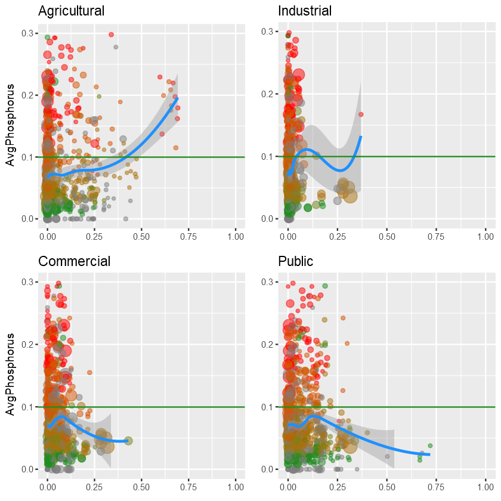
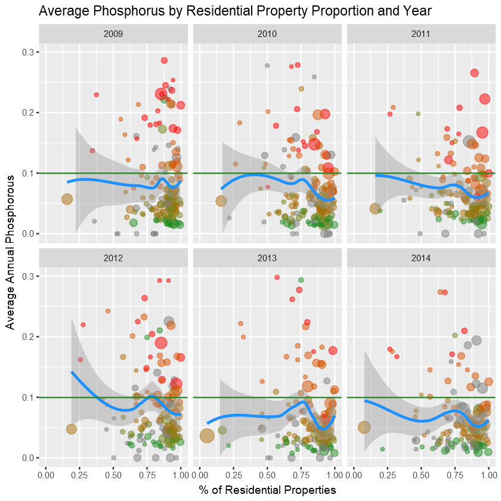
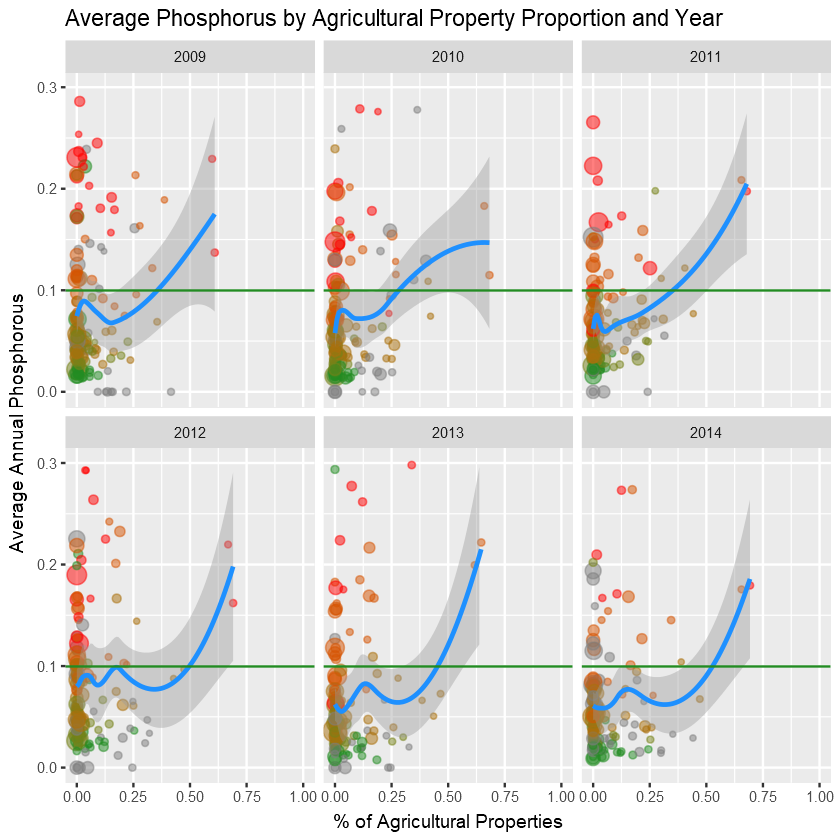
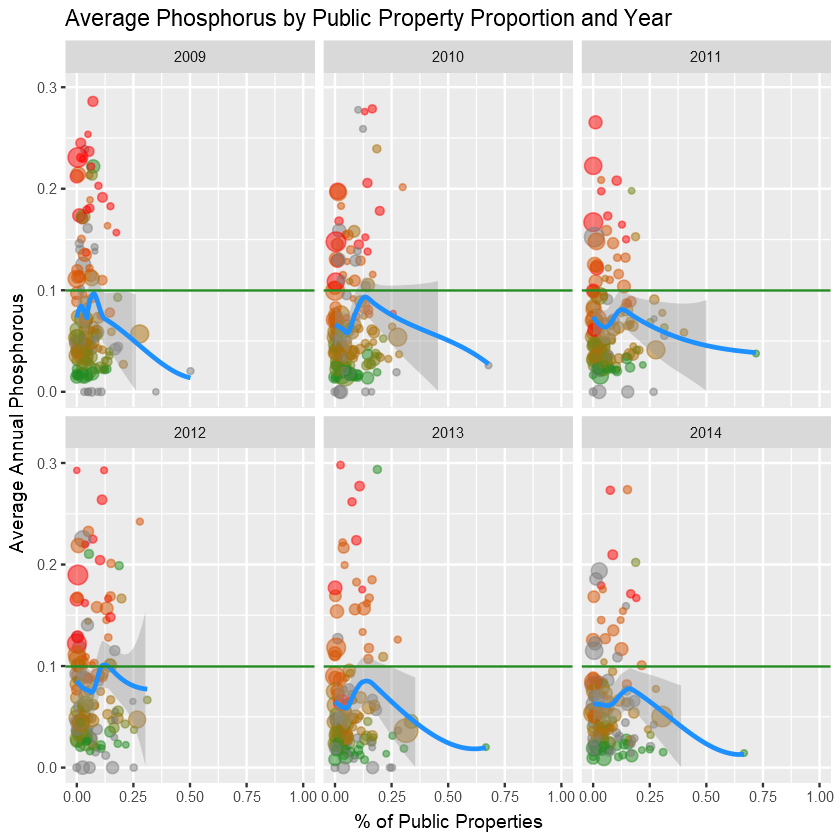

```R
suppressPackageStartupMessages({
  library(dplyr)
  library(ggplot2)
  library(readr)
})
options(dplyr.width = Inf)  # Shows all dplyr columns

options(jupyter.plot_mimetypes = 'image/png')  # Shows plots inline
```

    Warning message:
    "package 'readr' was built under R version 3.3.3"


```R
df <- read_csv("~/Kaggle/Dive Into Water/Github Upload/PropertiesPerLake.csv", na="#N/A")

df <- filter(df, AvgPhosphorus <= 0.3)
```

    Parsed with column specification:
    cols(
      LakeName = col_character(),
      Year = col_integer(),
      ResidentialCount = col_integer(),
      AgriculturalCount = col_integer(),
      CommercialCount = col_integer(),
      IndustrialCount = col_integer(),
      PublicCount = col_integer(),
      AvgSeasonalLakeGrade = col_integer(),
      AvgSecchiDepth = col_double(),
      AvgPhosphorus = col_double(),
      ResidentialProportion = col_double(),
      AgriculturalProportion = col_double(),
      CommercialProportion = col_double(),
      IndustrialProportion = col_double(),
      PublicProportion = col_double(),
      TotalCount = col_integer()
    )
    

# Data Description:

This dataset contains information about the counts and proportion of property types (bucketed into residential, agricultural, commercial, industrial, and public) within a 10km distance of a lake by year.  Additionally, it contains a few measures of water quality:

- AvgSeasonalLakeGrade (0 - 4, 4 being best): An annual rating given to a lake.  Compiled from readings taken from May through September.
- AvgSecchiDepth: The average annual depth (in inches) from readings taken with a Secchi disk throughout the year.  Higher quantities indicate water clarity.
- AvgPhosphorus: The average phosphorus content (in parts per million) taken from readings throughout the year.  Quantities below 0.01 indicate a lack of resources for plant live, and quantities above 0.1 are considered eutrophic - when the lake is too rich in nutrients, and results in the decomposition from a dense plant population killing animal life through depriving it of oxygen

These health measures are calculated averages of readings across the year.  Outliers and lakes/year combinations with a low number of readings were removed to prevent them from skewing the results.

Here is a preview of the data along with the summary statistics:


```R
head(df)
summary(df)
```


<table>
<thead><tr><th scope=col>LakeName</th><th scope=col>Year</th><th scope=col>ResidentialCount</th><th scope=col>AgriculturalCount</th><th scope=col>CommercialCount</th><th scope=col>IndustrialCount</th><th scope=col>PublicCount</th><th scope=col>AvgSeasonalLakeGrade</th><th scope=col>AvgSecchiDepth</th><th scope=col>AvgPhosphorus</th><th scope=col>ResidentialProportion</th><th scope=col>AgriculturalProportion</th><th scope=col>CommercialProportion</th><th scope=col>IndustrialProportion</th><th scope=col>PublicProportion</th><th scope=col>TotalCount</th></tr></thead>
<tbody>
	<tr><td>Acorn Lake    </td><td>2009          </td><td>8968          </td><td> 11           </td><td> 0            </td><td>27            </td><td>561           </td><td>NA            </td><td>0.9141667     </td><td>0.04333333    </td><td>0.9373889     </td><td>0.001149786   </td><td>0.000000000   </td><td>0.002822201   </td><td>0.058639072   </td><td>9567          </td></tr>
	<tr><td>Alimagnet Lake</td><td>2009          </td><td>5257          </td><td>  0           </td><td>89            </td><td> 0            </td><td>  2           </td><td> 1            </td><td>0.7050000     </td><td>0.09720000    </td><td>0.9829843     </td><td>0.000000000   </td><td>0.016641735   </td><td>0.000000000   </td><td>0.000373972   </td><td>5348          </td></tr>
	<tr><td>Ardmore Lake  </td><td>2009          </td><td> 693          </td><td> 20           </td><td>70            </td><td> 8            </td><td> 14           </td><td> 0            </td><td>0.4707143     </td><td>0.23071429    </td><td>0.8608696     </td><td>0.024844720   </td><td>0.086956522   </td><td>0.009937888   </td><td>0.017391304   </td><td> 805          </td></tr>
	<tr><td>Armstrong Lake</td><td>2009          </td><td>4572          </td><td> 20           </td><td> 8            </td><td> 0            </td><td>465           </td><td> 2            </td><td>1.1142857     </td><td>0.05892857    </td><td>0.9026654     </td><td>0.003948667   </td><td>0.001579467   </td><td>0.000000000   </td><td>0.091806515   </td><td>5065          </td></tr>
	<tr><td>Barker Lake   </td><td>2009          </td><td> 153          </td><td>119           </td><td> 0            </td><td> 0            </td><td> 14           </td><td>NA            </td><td>1.4588571     </td><td>0.00000000    </td><td>0.5349650     </td><td>0.416083916   </td><td>0.000000000   </td><td>0.000000000   </td><td>0.048951049   </td><td> 286          </td></tr>
	<tr><td>Bass Lake     </td><td>2009          </td><td> 340          </td><td>103           </td><td> 0            </td><td> 0            </td><td> 14           </td><td> 3            </td><td>1.9399697     </td><td>0.04938461    </td><td>0.7439825     </td><td>0.225382932   </td><td>0.000000000   </td><td>0.000000000   </td><td>0.030634573   </td><td> 457          </td></tr>
</tbody>
</table>


       LakeName              Year      ResidentialCount  AgriculturalCount
     Length:830         Min.   :2009   Min.   :   37.0   Min.   :   0.00  
     Class :character   1st Qu.:2010   1st Qu.:  326.2   1st Qu.:   0.00  
     Mode  :character   Median :2011   Median : 1437.0   Median :  16.00  
                        Mean   :2011   Mean   : 2945.1   Mean   :  58.61  
                        3rd Qu.:2013   3rd Qu.: 3596.5   3rd Qu.:  56.00  
                        Max.   :2014   Max.   :22679.0   Max.   :1700.00  
                                                                          
     CommercialCount   IndustrialCount    PublicCount      AvgSeasonalLakeGrade
     Min.   :    0.0   Min.   :    0.0   Min.   :    0.0   Min.   :0.000       
     1st Qu.:    2.0   1st Qu.:    0.0   1st Qu.:   16.0   1st Qu.:1.000       
     Median :   36.0   Median :    0.0   Median :   58.0   Median :2.000       
     Mean   :  195.5   Mean   :   98.5   Mean   :  172.2   Mean   :2.112       
     3rd Qu.:  173.8   3rd Qu.:   30.0   3rd Qu.:  149.0   3rd Qu.:3.000       
     Max.   :11870.0   Max.   :11764.0   Max.   :11739.0   Max.   :4.000       
                                                           NA's   :152         
     AvgSecchiDepth   AvgPhosphorus     ResidentialProportion
     Min.   :0.0000   Min.   :0.00000   Min.   :0.05415      
     1st Qu.:0.8834   1st Qu.:0.03117   1st Qu.:0.71023      
     Median :1.5415   Median :0.05137   Median :0.85195      
     Mean   :1.7525   Mean   :0.07322   Mean   :0.80138      
     3rd Qu.:2.3119   3rd Qu.:0.09663   3rd Qu.:0.92370      
     Max.   :8.0000   Max.   :0.29800   Max.   :0.99939      
                                                             
     AgriculturalProportion CommercialProportion IndustrialProportion
     Min.   :0.000000       Min.   :0.000000     Min.   :0.000000    
     1st Qu.:0.000000       1st Qu.:0.001377     1st Qu.:0.000000    
     Median :0.008379       Median :0.024324     Median :0.000000    
     Mean   :0.068790       Mean   :0.041181     Mean   :0.011521    
     3rd Qu.:0.090964       3rd Qu.:0.059121     3rd Qu.:0.008295    
     Max.   :0.692754       Max.   :0.429788     Max.   :0.368750    
                                                                     
     PublicProportion    TotalCount   
     Min.   :0.00000   Min.   :  100  
     1st Qu.:0.01596   1st Qu.:  397  
     Median :0.05204   Median : 1652  
     Mean   :0.07713   Mean   : 3470  
     3rd Qu.:0.11336   3rd Qu.: 4484  
     Max.   :0.71958   Max.   :37398  
                                      


This function was taken from the [Cookbook for R](http://www.cookbook-r.com/Graphs/Multiple_graphs_on_one_page_(ggplot2%29) to imitate a facet grid with multiple plots.


```R
# Multiple plot function
#
# ggplot objects can be passed in ..., or to plotlist (as a list of ggplot objects)
# - cols:   Number of columns in layout
# - layout: A matrix specifying the layout. If present, 'cols' is ignored.
#
# If the layout is something like matrix(c(1,2,3,3), nrow=2, byrow=TRUE),
# then plot 1 will go in the upper left, 2 will go in the upper right, and
# 3 will go all the way across the bottom.
#
multiplot <- function(..., plotlist=NULL, file, cols=1, layout=NULL) {
    library(grid)
    
    # Make a list from the ... arguments and plotlist
    plots <- c(list(...), plotlist)
    
    numPlots = length(plots)
    
    # If layout is NULL, then use 'cols' to determine layout
    if (is.null(layout)) {
        # Make the panel
        # ncol: Number of columns of plots
        # nrow: Number of rows needed, calculated from # of cols
        layout <- matrix(seq(1, cols * ceiling(numPlots/cols)),
                         ncol = cols, nrow = ceiling(numPlots/cols))
    }
    
    if (numPlots==1) {
        print(plots[[1]])
        
    } else {
        # Set up the page
        grid.newpage()
        pushViewport(viewport(layout = grid.layout(nrow(layout), ncol(layout))))
        
        # Make each plot, in the correct location
        for (i in 1:numPlots) {
            # Get the i,j matrix positions of the regions that contain this subplot
            matchidx <- as.data.frame(which(layout == i, arr.ind = TRUE))
            
            print(plots[[i]], vp = viewport(layout.pos.row = matchidx$row,
                                            layout.pos.col = matchidx$col))
        }
    }
}
```

## Plots

**Y:** Avg phosphorus

**X:** Proportion of proprerty type

**Color:** Average Lake Grade

**Size:** Density

**Green horizontal line:** [Eutrophic](https://en.wikipedia.org/wiki/Eutrophication).  Anything over this is considered bad for lake health.


```R
# Residential proportion
resPhos <- ggplot(df, aes(ResidentialProportion, AvgPhosphorus)) +  # Creating the ggplot object
  geom_point(aes(color=AvgSeasonalLakeGrade, size=TotalCount), alpha=0.5) +  # Adding scatterplot
  scale_colour_gradient(low="red", high="forestgreen") +  # Adjusting color scale
  geom_smooth(method='loess', color='dodgerblue') +  # Adding LOESS smoothing line
  xlim(0, 1) +  # Adjusting x-axis boundaries
  ylim (0, 0.3) +  # Adjusting y-axis boundaries
  labs(title='Average Phosphorous by Proportion of Residential Properties near Lake',  # Plot title
       x='% of Residential Propertie',  # X-axis label
       y = 'Average Annual Phosphorous',  # Y-axis label
       color='Seasonal Grade',  # Color label
       size='# Properties') +  # Size abel
  geom_hline(yintercept=0.1, color='forestgreen')  # Horizontal line for eutrophic phosphorous levels

resPhos
```


{:class="img-responsive"}


Examinining the remaining properties.  Beginning with setting up the other four categories for the "facet grid" by creating ggplot objects:


```R
# Agricultural
agrPhos <- ggplot(df, aes(AgriculturalProportion, AvgPhosphorus)) +
             geom_point(aes(color=AvgSeasonalLakeGrade, size=TotalCount), alpha=.5) +  # Creating the scatterplot
             scale_colour_gradient(low="red", high="forestgreen") +  # Setting the color scale
             geom_smooth(method='loess', color='dodgerblue') +  # Creating the LOESS smoothing line
             xlim(0, 1) +  # Setting the x-axis limits
             ylim(0, 0.3) +  # Setting the y-axis lmits
             geom_hline(yintercept=0.1, color='forestgreen') +  # Adding the line for the eutrophic cutoff
             theme(legend.position="none")  # Legend disabled to save space on slide containing facet grid

# Commercial
comPhos <- ggplot(df, aes(CommercialProportion, AvgPhosphorus)) +
             geom_point(aes(color=AvgSeasonalLakeGrade, size=TotalCount), alpha=.5) +  # Creating the scatterplot
             scale_colour_gradient(low="red", high="forestgreen") +  # Setting the color scale
             geom_smooth(method='loess', color='dodgerblue') +  # Creating the LOESS smoothing line
             xlim(0, 1) +  # Setting the x-axis limits
             ylim(0, 0.3) +  # Setting the y-axis lmits
             geom_hline(yintercept=0.1, color='forestgreen') +  # Adding the line for the eutrophic cutoff
             theme(legend.position="none")  # Legend disabled to save space on slide containing facet grid
# Industrial
indPhos <- ggplot(df, aes(IndustrialProportion, AvgPhosphorus)) +
             geom_point(aes(color=AvgSeasonalLakeGrade, size=TotalCount), alpha=.5) +  # Creating the scatterplot
             scale_colour_gradient(low="red", high="forestgreen") +  # Setting the color scale
             geom_smooth(method='loess', color='dodgerblue') +  # Creating the LOESS smoothing line
             xlim(0, 1) +  # Setting the x-axis limits
             ylim(0, 0.3) +  # Setting the y-axis lmits
             geom_hline(yintercept=0.1, color='forestgreen') +  # Adding the line for the eutrophic cutoff
             theme(legend.position="none")  # Legend disabled to save space on slide containing facet grid

# Public
pubPhos <- ggplot(df, aes(PublicProportion, AvgPhosphorus)) +
             geom_point(aes(color=AvgSeasonalLakeGrade, size=TotalCount), alpha=.5) +  # Creating the scatterplot
             scale_colour_gradient(low="red", high="forestgreen") +  # Setting the color scale
             geom_smooth(method='loess', color='dodgerblue') +  # Creating the LOESS smoothing line
             xlim(0, 1) +  # Setting the x-axis limits
             ylim(0, 0.3) +  # Setting the y-axis lmits
             geom_hline(yintercept=0.1, color='forestgreen') +  # Adding the line for the eutrophic cutoff
             theme(legend.position="none")  # Legend disabled to save space on slide containing facet grid


# Plotting the "facet grid"
multiplot(agrPhos + labs(title = "Agricultural", x = element_blank()), 
          comPhos + labs(title = "Commercial", x = element_blank()), 
          indPhos + labs(title = "Industrial", x = element_blank(), y = element_blank()), 
          pubPhos + labs(title = "Public", x = element_blank(), y = element_blank()), 
          cols = 2)
```





Viewing the **residential** properties over time:


```R
# Resident property influence over time
resPhos + 
    facet_wrap(~ Year) + 
    labs(title = "Average Phosphorus by Residential Property Proportion and Year", 
         x = "% of Residential Properties", 
         y = "Average Annual Phosphorous", 
         color = 'Seasonal Grade', 
         size = '# Properties') + 
    theme(legend.position = "none")
```





Highly residential areas are reducing in phosphorus over time

**Agricultural** plots over time:


```R
# Agricultural property influence over time
agrPhos + 
    facet_wrap(~ Year) + 
    labs(title = "Average Phosphorus by Agricultural Property Proportion and Year", 
         x = "% of Agricultural Properties", 
         y = "Average Annual Phosphorous", 
         color = 'Seasonal Grade', 
         size = '# Properties')
```





Moderately agricultural areas (0.2 - 0.4) are decreasing in phosphorus over time

**Public:**


```R
# Public property influence over time
pubPhos + 
    facet_wrap(~ Year) + 
    labs(title = "Average Phosphorus by Public Property Proportion and Year", 
         x = "% of Public Properties", 
         y = "Average Annual Phosphorous", 
         color = 'Seasonal Grade', 
         size = '# Properties')
```





No discernable differences

**Commercial** and **Industrial** properties over time excluded due to lack of conclusions resulting from a very small overall percentage.
